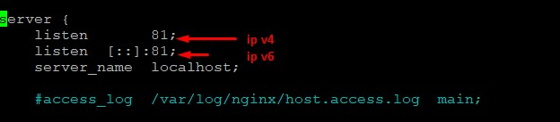
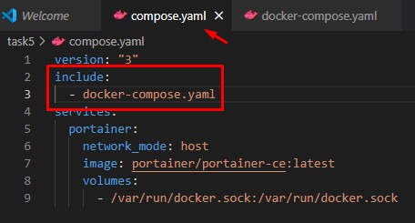
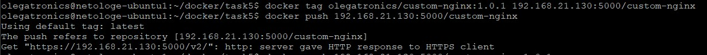
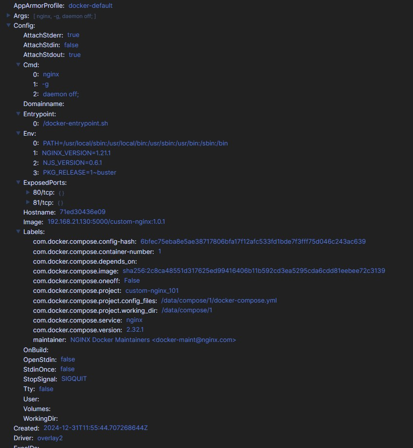

# Домашнее задание к занятию 4 «Оркестрация группой Docker контейнеров на примере Docker Compose»

## Задача 1 (задание + решение)

Сценарий выполнения задачи:
- Установите docker и docker compose plugin на свою linux рабочую станцию или ВМ.
  - docker и docker-compose были установлены на ВМ под управлением Ubuntu Server 24.04.1 LTS

- Если dockerhub недоступен создайте файл /etc/docker/daemon.json с содержимым:   
  ```{"registry-mirrors": ["https://mirror.gcr.io", "https://daocloud.io", "https://c.163.com/", "https://registry.docker-cn.com"]}```
  - DockerHub был доступен, за исключением сайта https://hub.docker.com/ . Решение - использование браузерного VPN, docker pull и docker push работали без проблем.

- Зарегистрируйтесь и создайте публичный репозиторий  с именем "custom-nginx" на https://hub.docker.com (ТОЛЬКО ЕСЛИ У ВАС ЕСТЬ ДОСТУП);  
  - Репозиторий DockerHub для обучения создан, попасть на него можно поссылке [Репозиторий Docker](https://hub.docker.com/r/olegatronics/custom-nginx)

- скачайте образ nginx:1.21.1;
  - Образ загружен командой:
    ```docker
    docker image pull nginx:1.21.1
    ```
- Создайте Dockerfile и реализуйте в нем замену дефолтной индекс-страницы(/usr/share/nginx/html/index.html), на файл index.html с содержимым:
    ```html
    <html>
        <head>
            Hey, Netology
        </head>
        <body>
            <h1>I will be DevOps Engineer!</h1>
        </body>
    </html>
    ```
  - Для изменения главной (```index.html```) страницы достаточно скопировать её с хостовой машины в контейнер, прописав в ```Dockerfile``` следующим способом:
    ```docker
        FROM nginx:1.21.1
        COPY index.html /usr/share/nginx/html/index.html
    ```
- Соберите и отправьте созданный образ в свой dockerhub-репозитории c tag 1.0.0 (ТОЛЬКО ЕСЛИ ЕСТЬ ДОСТУП). 
  - Для сборки использовал следующие команды:
    ```docker
    # Собираем образ
    sudo docker build .
    # Добавляем TAG (где a2c - первые 3 символа ID образа)
    sudo docker tag a2c olegatronics/custom-nginx:1.0.0
    # Логинимся в свой репозиторий под своим пользователем
    sudo docker login -u olegatronics -p <password>
    # Отправляем свой образ в свой репозиторий custom-nginx
    sudo docker push olegatronics/custom-nginx:1.0.0
    ```
- Предоставьте ответ в виде ссылки на https://hub.docker.com/<username_repo>/custom-nginx/general .
  - Репозиторий доступен по [ссылке](https://hub.docker.com/r/olegatronics/custom-nginx)
  

## Задача 2 (задание + решение)

1. Запустите ваш образ custom-nginx:1.0.0 командой docker run в соответвии с требованиями:
- имя контейнера "ФИО-custom-nginx-t2"
- контейнер работает в фоне
- контейнер опубликован на порту хост системы 127.0.0.1:8080
  
  - Контейнер запущен командой:
    ```docker
    sudo docker run -d --name "asharchuk-O-D-custom-nginx-t2" -p 8080:80 olegatronics/custom-nginx:1.0.0
    ```
    
2. Не удаляя, переименуйте контейнер в "custom-nginx-t2"  
   
   Переименовал контейнер командой:
    ```docker
    sudo docker container rename asharchuk-O-D-custom-nginx-t2 custom-nginx-t2
    ```
      
3. Выполните команду 
   ```bash
   date +"%d-%m-%Y %T.%N %Z" ; sleep 0.150 ; docker ps ; ss -tlpn | grep 127.0.0.1:8080  ; docker logs custom-nginx-t2 -n1 ; docker exec -it custom-nginx-t2 base64 /usr/share/nginx/html/index.html
   ```
   После выполнения команды столкнулся с проблемой
   ```bash
   permission denied while trying to connect to the Docker daemon socket...
   ``` 
   Решение пришло быстро - прописать нужные права на docker.sock:
   ```bash
   sudo chmod 666 /var/run/docker.sock
   ```
    

4. Убедитесь с помощью curl или веб браузера, что индекс-страница доступна.  
 
   Для curl проверил ```localhost: curl 127.0.0.1:8080```  
   для веб-браузера - ```IP ВМ с портом 8080```
  
    

## Задача 3 (задание + решение)

1. Воспользуйтесь docker help или google, чтобы узнать как подключиться к стандартному потоку ввода/вывода/ошибок контейнера "custom-nginx-t2".  

   Удачно подключился к стандартному потоку ввода/вывода ошибок, увидел, что показывает любые действия, н.п. так как кроме страницы толком посмотреть ничего нельзя, то этого для теста оказалось вполне показательным, благодаря чему я увидел как оно работает.

    

2. Подключитесь к контейнеру и нажмите комбинацию Ctrl-C.
   
    В данном случае подключиться к контейнеру нельзя, т.к. контейнер находится в режиме ввода/вывода/ошибок. Т.к. docker attach взаимодействует с основным контейнером, то при попытке выйти способом CTRL+C, мы выйдем не только из режима ввода/вывода/ошибок, но и остановим сам контейнер.

3. Выполните ```docker ps -a``` и объясните своими словами почему контейнер остановился.

    В текущем случае при выводе команды docker ps -a мы увидим, что контейнер остановлен. более подробно я описал в пункте 2, Повторюсь, что комбинация CTRL+C вместе с выходом из режима ввода/вывода/ошибок так же останавливает контейнер. Выйти из режима ввода/вывода/ошибок (так называемый Detach) без остановки контейнера можно, но контенер должен быть апущен с параметрами -it или -d

4. Перезапустите контейнер

    т.к. в данному случае контейнер остановлен, то его достаточно запустить командой docker start custom-nginx-t2
    
    .jpg)

5. Зайдите в интерактивный терминал контейнера "custom-nginx-t2" с оболочкой bash.
   
    Произвёл вход под пользователем root (не обязательно было) командой 
    ```docker
    docker exec -u root -it custom-nginx-t2 bash
    ```
6. Установите любимый текстовый редактор(vim, nano итд) с помощью apt-get.
    После того, как я вошел в контейнер, я запустил команду ```apt-get install nano```, однако столкнулся с ошибкой о неизвестном расположении пакета nano. Что я сделал. Первым делом я обновил apt.
    ```bash
    apt-get udate
    ```
    Обновление прошло без проблем и ошибок, далее я снова запустил процесс утсановки nano и процесс прошел так же без ошибок, nano утсновился и запускается.

    .jpg)

7. Отредактируйте файл "/etc/nginx/conf.d/default.conf", заменив порт "listen 80" на "listen 81".

    С помощью текстового редактора nano, который установил на предыдущем шаге, отредактировал файл /etc/nginx/conf.d/defaults.conf, где поменял ```listen 80``` на ```listen 81```

    

8. Запомните(!) и выполните команду ```nginx -s reload```, а затем внутри контейнера ```curl http://127.0.0.1:80 ; curl http://127.0.0.1:81```.
   
   Выполнил команду ```nginx -s reload```, а затем, внутри контейнера ```curl http://127.0.0.1:80 ; curl http://127.0.0.1:81``` и убедился, что внутри контейнера порт поменялся, что теперь страница открывается по порту 81, а а порту 80 ошибка "Connection refused"

   .jpg)

9.  Выйдите из контейнера, набрав в консоли  ```exit``` или Ctrl-D.
    
    Вышел из контейнера командой ```exit```

10. Проверьте вывод команд: ```ss -tlpn | grep 127.0.0.1:8080``` , ```docker port custom-nginx-t2```, ```curl http://127.0.0.1:8080```. Кратко объясните суть возникшей проблемы.

    Это не является проблемой. Если вкратце, то внутри контейнера мы поменяли порт доступа в конфигурации с 80 на 81, перезапустили службу внутри контейнера и внутри контейнера мы имеем доступ, однако запущенный контейнер на хостовой машине ссылается на старый 80-й порт и пытается его пробростить, но он у нас уже не доступен. Для этого нужно заново пробросить порт, но уже не 80, а 81, тогда все заработает.

11. Это дополнительное, необязательное задание. Попробуйте самостоятельно исправить конфигурацию контейнера, используя доступные источники в интернете. Не изменяйте конфигурацию nginx и не удаляйте контейнер. Останавливать контейнер можно. [пример источника](https://www.baeldung.com/linux/assign-port-docker-container)

    Данное задание я решил сделать используя docker commit. Суть какая: нам необходимо поправить порт запущенного контейнера, при этом, чтобы данные которые мы меняли внутри контейнера - не поерялись, один из способов использовать docker commit и создать образ. Первым делом я остановил текущий образ custom-nginx-t2
    ```docker
    docker stop custom-nginx-t2
    ```
    Далее командой docker commit я сделал новый образ на основе остановленного контейнера
    ```docker
    docker commit custom-nginx-t2 olegatronics/custom-nginx:1.0.1
    ```
    и убедился, что образ создался 
    ```docker
    docker images
    ```
    В теге я поправил версию на 1.0.1. После того, как я убедился, что образ создан есть у нас я начал его разворачивать
    ```docker
    sudo docker run -d --name "custom-nginx-t2" -p 8080:81 olegatronics/custom-nginx:1.0.1
    ```
    однако столкнулся с тем, что образ с таким именем у нас уже есть - это старый остановленный образ. Решения в данном случае два. Первое - сделать дрйгое имя новому контейнеру. Второе - удалить старый контейнер, чтобы оставить старое имя. Я пошел по второму пути, т.к. во первых этот образ мне не нужен и так я освобожу еще и ресурс сервера.
    ```docker
    docker remove custom-nginx-t2
    ```
    После повторной попытки развернуть контейнер - контейнер развернулся и пробросился с порта 81 контенера на 8080 хостовой машины, о чем подтверждает утилита curl [curl 127.0.0.1:8080].
    В браузере страница так же открылась без проблем.

    

12. Удалите запущенный контейнер "custom-nginx-t2", не останавливая его. (воспользуйтесь --help или google)

    Воспользовался командой docker rm с флагом -f (force), который останавливает контейнер перед уделанием, используя SIGKILL [docker rm -f custom-nginx-t2] (офф. документация docker)

    

## Задача 4 (задание + решение)

- Запустите первый контейнер из образа ***centos*** c любым тегом в фоновом режиме, подключив папку  текущий рабочий каталог ```$(pwd)``` на хостовой машине в ```/data``` контейнера, используя ключ -v.  
  
    Для подключения каталога к контейнеру centos использовал команду 
    ```docker
    docker run -d -v ~/docker:/data --name centos -it centos bash
    ```

- Запустите второй контейнер из образа ***debian*** в фоновом режиме, подключив текущий рабочий каталог ```$(pwd)``` в ```/data``` контейнера. 

    Для подключения каталога к контейнеру debian использовал команду
    ```docker
    docker run -d -v ~/docker:/data --name debian -it debian /bin/sh
    ```
    В папке ```~/docker``` хостовой машины создал сразу текстовый файл ```test.txt```, чтобы убедиться, что в контейнерах его так же видно и подключение раболтает

    .jpg)

- Подключитесь к первому контейнеру с помощью ```docker exec``` и создайте текстовый файл любого содержания в ```/data```.
  
    Подключился пользователем root к контейнеру командой
    ```docker
    docker exec -u root -it centos /bin/bash
    ```
    Переместился в папку ```/data```, увидел там созданный на локальном хосте файл ```test.txt```, сюда же я в контейнере создал файл ```test_centos.txt```, используя редактор ```vi```. Далее я проверил ```ls``` что файл создался. Послк чего я вышел из контейнера и с хостовой машины просмотрел список файлов ```ls -la ~/docker```, где увидел созданный в контейнере файл.

- Добавьте ещё один файл в текущий каталог ```$(pwd)``` на хостовой машине.
  
    Добавил файл ```test2.txt``` в рабочий каталог на хостовой машине.

    .jpg)

- Подключитесь во второй контейнер и отобразите листинг и содержание файлов в ```/data``` контейнера.

    Подключился пользователем root к контейнру используя команду 
    ```docker
    docker exec -u root -it centos /bin/bash
    ```
    Отобразил файлы командой ```ls -la```, увидел 3 файла, 2 из которых были созданы на хостовой машине (```test.txt``` и ```test2.txt```) один в контейнере centos(```test_centos.txt```).

    

## Задача 5 (задание + решение)

1. Создайте отдельную директорию(например /tmp/netology/docker/task5) и 2 файла внутри него.
"compose.yaml" с содержимым:

    ```
    version: "3"
    services:
    portainer:
        network_mode: host
        image: portainer/portainer-ce:latest
        volumes:
        - /var/run/docker.sock:/var/run/docker.sock
    ```

    "docker-compose.yaml" с содержимым:

    ```bash
    version: "3"
    services:
    registry:
        image: registry:2

        ports:
        - "5000:5000"
    ```  

    И выполните команду "docker compose up -d". Какой из файлов был запущен и почему? (подсказка: https://docs.docker.com/compose/compose-application-model/#the-compose-file )
___
После выполнения команды "```docker compose up -d```" мы видим, что обнаружено 2 конфигурационных файла, которые он может прочитать и выполнить инструкции, однако видим, что был выран ```compose.yaml```, почему так произошло: ```docker-compose.yaml``` (или ```.yml```) был создан для обратной совместимости со старыми версиями copmose, поэтому если в директории находятся 2 файла, то согласно документации приоритетом compose будет выбирать ```compose.yaml``` (```.yml```).
___


2. Отредактируйте файл compose.yaml так, чтобы были запущенны оба файла. (подсказка: https://docs.docker.com/compose/compose-file/14-include/)

    В Файл добавлена инструкция, которая делает включение файла docker-compose.yaml
        include:
            - docker-compose.yaml

    

    После запуска ```docker compose up -d``` поднялись оба контейнера: ```portainer``` и ```registry```

3. Выполните в консоли вашей хостовой ОС необходимые команды чтобы залить образ custom-nginx как custom-nginx:latest в запущенное вами, локальное registry. Дополнительная документация: https://distribution.github.io/distribution/about/deploying/

Для того, чтобы залить образ custom-nginx необходимо выполнить 2 команды:

Выбрать локальный registry, основываясь на текущем образе с tag 1.0.1
```docker
docker tag olegatronics/custom-nginx:1.0.1 192.168.21.130:custom-nginx
```
После этого начнем заливать образ в локальный registry. Если не присвоить tag, то он присвоит автоматически tag ```latest```
```docker
docker push 192.168.21.130:5000/custom-nginx
```



4. Откройте страницу "https://127.0.0.1:9000" и произведите начальную настройку portainer (логин и пароль адмнистратора)

    Страница открылась, была произведена первичная настройка (логин и пароль администратора), после чего я попал на главную страницу portainer

5. Откройте страницу "http://127.0.0.1:9000/#!/home", выберите ваше local  окружение. Перейдите на вкладку "stacks" и в "web editor" задеплойте следующий компоуз:

```
version: '3'

services:
  nginx:
    image: 127.0.0.1:5000/custom-nginx
    ports:
      - "9090:80"
```


6. Перейдите на страницу "http://127.0.0.1:9000/#!/2/docker/containers", выберите контейнер с nginx и нажмите на кнопку "inspect". В представлении <> Tree разверните поле "Config" и сделайте скриншот от поля "AppArmorProfile" до "Driver".




7. Удалите любой из манифестов компоуза(например compose.yaml).  Выполните команду "```docker compose up -d```". Прочитайте warning, объясните суть предупреждения и выполните предложенное действие. Погасите compose-проект ОДНОЙ(обязательно!!) командой.

    удалил compose.yaml, получил сообщение ```WARN[0000] /home/olegatronics/docker/task5/docker-compose.yaml: the attribute `version` is obsolete, it will be ignored, please remove it to avoid potential confusion```
        Решение - удалить аттрибут ```version```, который устарел исходя из полученного предупреждения. После этого все запустилось без дополнительных ошибок и предупреждений.
        Для того, чтобы погасить compose проект достаточно выполнить команду

    ```docker
    docker compose down
    ```

___
На этом все задачи считаю выполненными полностью. Все скриншоты приложены.

Моя конфигурация сервера, которая используется:  
Платформа: Intel Nuc на базе Intel Core i3 (9 поколение)  
В качестве гипервизора используется Proxmox  
В качестве ОС хостовой ВМ использовался Ubuntu 24.04.1 LTS

